# GYM-RL 强化学习算法实现

<div align="center">


从零实现 DQN、ConcatDQN、Double DQN、A3C 与 PPO，并在 Gym 环境中完成训练、可视化和模型保存。

</div>

## 项目概览

本项目是一个基于 PyTorch 的强化学习练习仓库，代码集中在 `MyProject/` 目录下。当前已包含：

| 算法 | 环境 | 入口文件 | 主要特点 |
| --- | --- | --- | --- |
| DQN | `LunarLander-v2` | `MyProject/DQN/main.py` | 经验回放、目标网络、epsilon-greedy 探索 |
| ConcatDQN | `LunarLander-v2` | `MyProject/DQN/ConcatDQN/DQN_concat.py` | 多层特征拼接的 Q 网络 |
| Double DQN | `LunarLander-v2` | `MyProject/DoubleDQN/DDQN_Beta.py` | 用策略网络选动作、目标网络估值，缓解 Q 值高估 |
| A3C | `CartPole-v1` | `MyProject/A3C/A3C.py` | 多进程 Actor-Critic，并行采样与异步更新 |
| PPO | `LunarLander-v2` | `MyProject/PPO/main.py` | 裁剪目标函数、GAE、Actor-Critic、学习率衰减 |

仓库中还保留了训练曲线、演示 GIF 和若干模型权重，便于复现实验结果或继续训练。

## 效果展示

<div align="center">

| DQN 登月演示 | DQN 奖励曲线 |
| :---: | :---: |
| 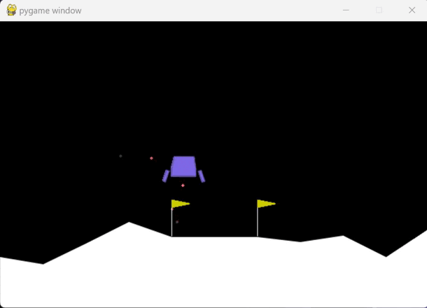 | 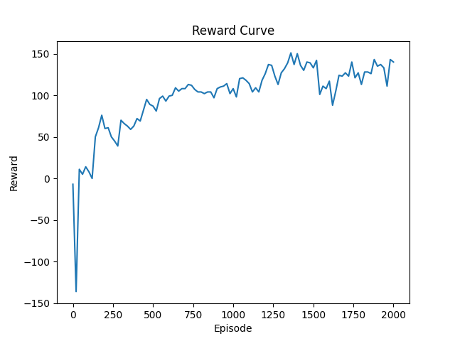 |

| PPO 最终训练曲线 |
| :---: |
| 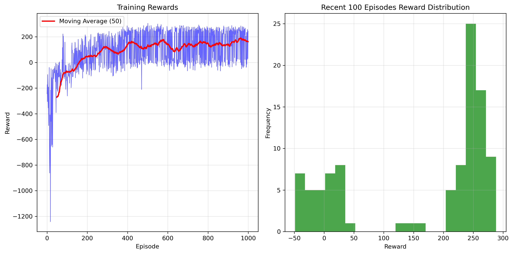 |

</div>

## 环境说明

### LunarLander-v2

`LunarLander-v2` 是本项目中 DQN、ConcatDQN、Double DQN 和 PPO 使用的主要环境。智能体需要控制登月器安全降落到指定平台。

| 项目 | 说明 |
| --- | --- |
| 状态维度 | 8 维连续状态 |
| 动作维度 | 4 个离散动作 |
| 目标 | 控制姿态、速度和位置，使登月器平稳着陆 |
| 常用达标标准 | 最近 100 局平均奖励达到 200 左右 |

状态向量通常包含位置、速度、角度、角速度以及两条腿是否接触地面等信息；动作空间包括不操作、左侧姿态发动机、主发动机、右侧姿态发动机。

### CartPole-v1

`A3C.py` 当前使用 `CartPole-v1`。它更轻量，适合作为多进程 Actor-Critic 的验证环境。

## 安装与依赖

推荐使用 Conda 创建环境：

```bash
conda env create -f MyProject/environment.yaml
conda activate GGYYMM
```

也可以按需安装核心依赖：

```bash
pip install torch gym numpy matplotlib
pip install box2d-py pygame swig
```

验证环境是否可用：

```bash
python -c "import torch; print(torch.__version__, torch.cuda.is_available())"
python -c "import gym; env = gym.make('LunarLander-v2'); print(env.observation_space, env.action_space)"
```

> 注：`LunarLander-v2` 依赖 Box2D。如果环境创建失败，优先检查 `box2d-py`、`pygame`、`swig` 是否安装成功。

## 快速运行

从仓库根目录进入对应算法目录后运行脚本。

### DQN

```bash
cd MyProject/DQN
python main.py
```

当前 DQN 训练入口中的主要参数：

| 参数 | 值 |
| --- | ---: |
| `BATCH_SIZE` | 128 |
| `GAMMA` | 0.99 |
| `EPS_START` | 0.9 |
| `EPS_END` | 0.05 |
| `EPS_DECAY` | 1000 |
| `TAU` | 0.005 |
| `LR` | 1e-4 |
| `ReplayMemory` | 10000 |

### Double DQN

```bash
cd MyProject/DoubleDQN
python DDQN_Beta.py
```

Double DQN 的训练参数与 DQN 接近，但学习率为 `0.002`，隐藏层宽度为 `256`，并在更新目标值时使用策略网络选择动作、目标网络评估动作。

### A3C

```bash
cd MyProject/A3C
python A3C.py
```

A3C 会按 `mp.cpu_count()` 创建多个 worker 进程。当前脚本使用 `CartPole-v1`，最大训练回合数为 `10000`，学习率为 `0.001`。

### PPO

```bash
cd MyProject/PPO
python main.py
```

PPO 当前配置如下：

| 参数 | 值 |
| --- | ---: |
| `epoch` | 3000 |
| `max_step` | 1000 |
| `batch_size` | 64 |
| `lr_start` | 1e-3 |
| `lr_end` | 1e-6 |
| `lr_decay` | 0.995 |
| `gamma` | 0.99 |
| `memory_size` | 10000 |
| `eps_clip` | 0.2 |
| `Lambda` | 0.95 |
| `K_epochs` | 4 |

模型会保存在：

```text
MyProject/PPO/model/ppo_model_epoch_{epoch}.pth
```

## 核心公式

### DQN 目标值

DQN 用目标网络计算 TD 目标：

```math
y_t = r_t + \gamma \max_{a'} Q_{\theta^-}(s_{t+1}, a')
```

损失函数为：

```math
\mathcal{L}(\theta) =
\operatorname{Huber}
\left(
Q_\theta(s_t, a_t),
y_t
\right)
```

其中，$\theta$ 表示策略网络参数，$\theta^-$ 表示目标网络参数。

### epsilon-greedy 探索

代码中使用指数衰减的探索率：

```math
\epsilon_t =
\epsilon_{\mathrm{end}}
+
\left(
\epsilon_{\mathrm{start}} - \epsilon_{\mathrm{end}}
\right)
\exp
\left(
-\frac{t}{\epsilon_{\mathrm{decay}}}
\right)
```

### Double DQN 目标值

标准 DQN 的最大化操作容易带来 Q 值高估。Double DQN 将动作选择和动作评估拆开：

```math
a^\ast =
\arg\max_{a'} Q_\theta(s_{t+1}, a')
```

```math
y_t =
r_t
+
\gamma Q_{\theta^-}(s_{t+1}, a^\ast)
```

### A3C 损失

A3C 使用 Actor-Critic 结构，整体损失可写为：

```math
\mathcal{L}
=
\mathcal{L}_{\mathrm{actor}}
+
c_v \mathcal{L}_{\mathrm{critic}}
-
c_e \mathcal{H}(\pi_\theta)
```

其中：

```math
\mathcal{L}_{\mathrm{actor}}
=
-\log \pi_\theta(a_t \mid s_t) A_t
```

```math
\mathcal{L}_{\mathrm{critic}}
=
\left(
V_\theta(s_t) - R_t
\right)^2
```

### PPO 裁剪目标

PPO 使用新旧策略概率比：

```math
r_t(\theta)
=
\frac{
\pi_\theta(a_t \mid s_t)
}{
\pi_{\theta_{\mathrm{old}}}(a_t \mid s_t)
}
```

裁剪目标函数为：

```math
\mathcal{L}^{\mathrm{CLIP}}(\theta)
=
\mathbb{E}_t
\left[
\min
\left(
r_t(\theta) A_t,
\operatorname{clip}
\left(
r_t(\theta),
1-\epsilon,
1+\epsilon
\right) A_t
\right)
\right]
```

### GAE 优势估计

PPO 中使用 GAE 计算优势：

```math
\delta_t
=
r_t
+
\gamma V(s_{t+1})
-
V(s_t)
```

```math
A_t^{\mathrm{GAE}(\gamma,\lambda)}
=
\sum_{l=0}^{\infty}
(\gamma \lambda)^l
\delta_{t+l}
```

代码中对应参数为 `gamma = 0.99`、`Lambda = 0.95`。

## 网络结构

### DQN

```text
state(8)
  -> Linear(8, 128) -> ReLU
  -> Linear(128, 128) -> ReLU
  -> Linear(128, action_dim)
```

### Double DQN

```text
state(8)
  -> Linear(8, 256) -> ReLU
  -> Linear(256, 256) -> ReLU
  -> Linear(256, action_dim)
```

### PPO ConcatNet

PPO 的 Actor 和 Critic 都复用了 `ConcatNet`。它先将输入映射到 512 维，再逐层拆分、压缩并拼接多层特征：

```text
input
  -> Linear(input_dim, 512) -> ReLU
  -> split: 256 preserved + 256 continued
  -> Linear(256, 256) -> ReLU
  -> split: 128 preserved + 128 continued
  -> Linear(128, 128) -> ReLU
  -> split: 64 preserved + 64 continued
  -> Linear(64, 64) -> ReLU
  -> concat(256, 128, 64, 64)
  -> Linear(512, output_dim)
```

Actor 输出动作概率分布；Critic 输出状态价值。

### ConcatDQN

ConcatDQN 使用更宽的特征拼接网络：

```text
state(8)
  -> Linear(8, 1024) -> ReLU
  -> split: 512 preserved + 512 continued
  -> Linear(512, 256) -> ReLU
  -> split: 128 preserved + 128 continued
  -> Linear(128, 64) -> ReLU
  -> split: 32 preserved + 32 continued
  -> Linear(32, 16) -> ReLU
  -> concat(512, 128, 32, 16)
  -> Linear(688, action_dim)
```

## 训练曲线

<div align="center">

| PPO Epoch 100 | PPO Epoch 200 | PPO Epoch 300 |
| :---: | :---: | :---: |
| 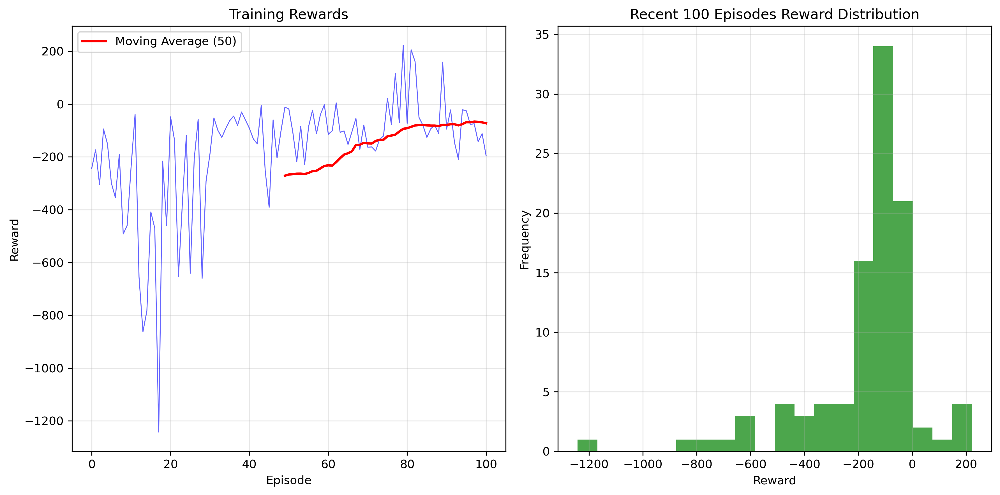 | 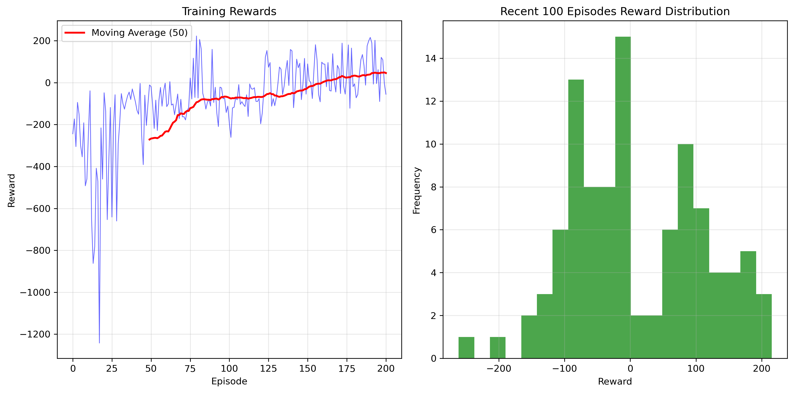 | 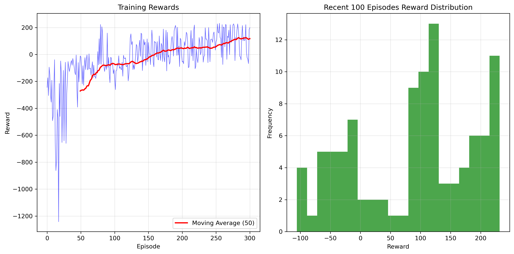 |

| PPO Epoch 500 | PPO Epoch 700 | PPO Final |
| :---: | :---: | :---: |
| 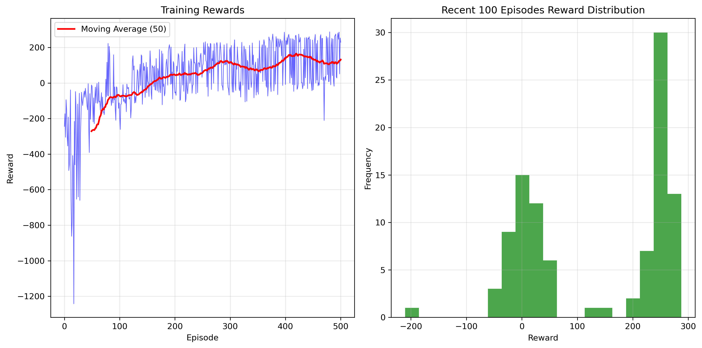 | 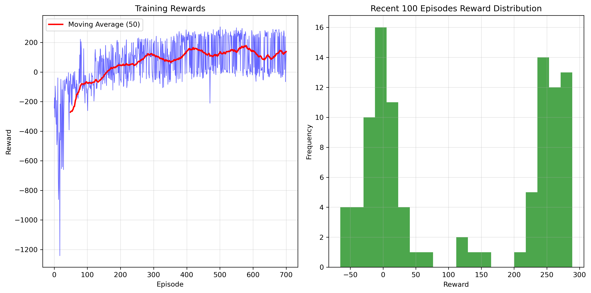 |  |

| ConcatDQN 平均长度 | ConcatDQN 回合 | ConcatDQN 奖励 |
| :---: | :---: | :---: |
| 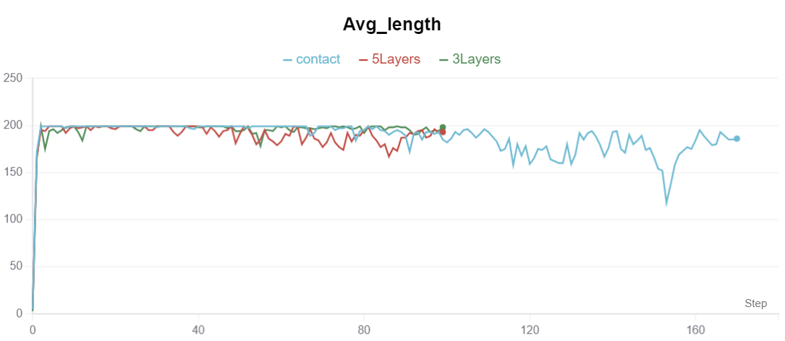 | 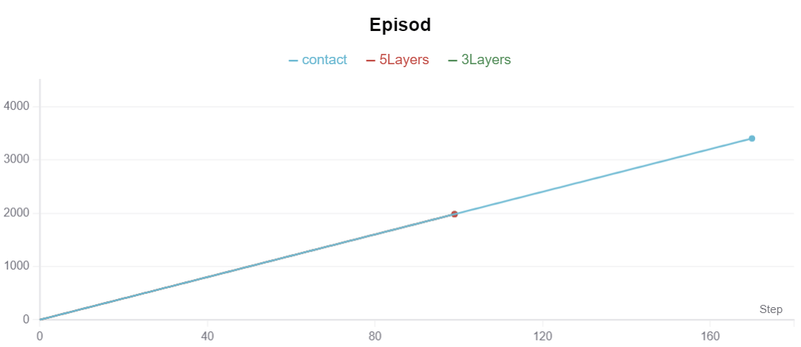 | 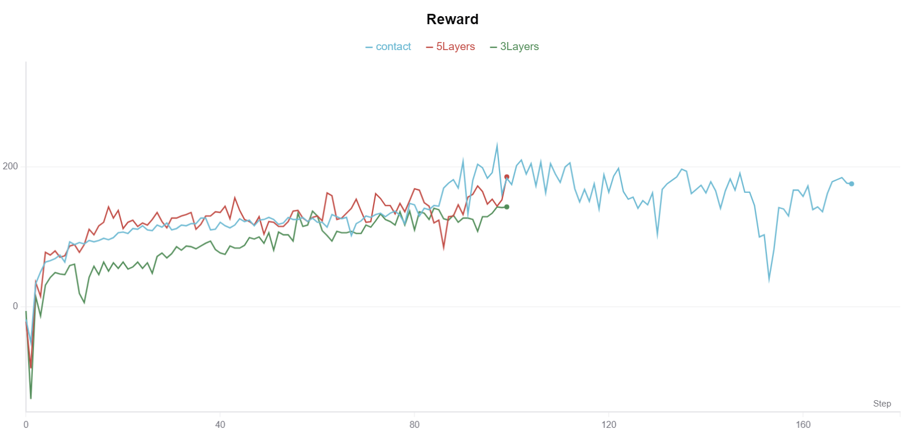 |

</div>

## 项目结构

```text
GYM-RL/
├── README.md
├── .gitattributes
└── MyProject/
    ├── environment.yaml
    ├── A3C/
    │   └── A3C.py
    ├── DoubleDQN/
    │   ├── DDQN_Beta.py
    │   └── DDQN_LunarLander-v2.pth
    ├── DQN/
    │   ├── DQN.py
    │   ├── main.py
    │   ├── DQN_LunarLander-v2_second.pth
    │   ├── DQN_second_round.gif
    │   ├── DQN_second_round_performance.png
    │   └── ConcatDQN/
    │       ├── DQN_concat.py
    │       ├── concat_example.py
    │       ├── Readme.md
    │       ├── Reward.csv
    │       ├── Reward.png
    │       ├── Episod.csv
    │       ├── Episod.png
    │       ├── Avg_length.csv
    │       └── Avg_length.png
    └── PPO/
        ├── main.py
        ├── agent.py
        ├── model.py
        ├── train_ppo.py
        ├── algorism_test.py
        ├── requirements.txt
        ├── README.md
        ├── logs/
        │   ├── final_training_curve.png
        │   ├── rewards_history.npy
        │   └── training_curve_epoch_*.png
        └── model/
            └── ppo_model_epoch_*.pth
```

## 实现要点

- DQN 和 Double DQN 使用 `deque(maxlen=10000)` 实现经验回放。
- DQN 使用 Huber Loss，并对梯度值进行裁剪。
- Double DQN 在目标值计算中解耦动作选择和动作评估。
- A3C 使用共享全局模型与多个 worker 进程并行采样。
- PPO 使用旧策略计算 `old_log_probs`，再通过裁剪概率比限制策略更新幅度。
- PPO 在更新前会标准化优势函数，提升训练稳定性。
- 所有主要算法都会自动选择 `cuda`、`mps` 或 `cpu` 设备。

## 已知注意事项

- 代码中的部分中文注释曾出现编码损坏，但主要训练逻辑仍可读、可运行。
- DQN 的 `main.py` 当前从 `range(4000, num_episodes)` 开始训练，适合接续实验；如果需要从零训练，可改为 `range(num_episodes)`。
- A3C 会启动多个进程，Windows 下运行时建议直接在命令行中执行脚本，避免交互式环境的多进程问题。
- 训练结果会受随机种子、显卡、Gym/Box2D 版本影响，曲线不会完全逐点复现。

## 参考资料

- [Playing Atari with Deep Reinforcement Learning](https://arxiv.org/abs/1312.5602)
- [Double Q-learning](https://papers.nips.cc/paper/2010/hash/091d584fced301b442654dd8c23b3fc9-Abstract.html)
- [Asynchronous Methods for Deep Reinforcement Learning](https://arxiv.org/abs/1602.01783)
- [Proximal Policy Optimization Algorithms](https://arxiv.org/abs/1707.06347)
- [High-Dimensional Continuous Control Using Generalized Advantage Estimation](https://arxiv.org/abs/1506.02438)
- [Gym LunarLander 文档](https://www.gymlibrary.dev/environments/box2d/lunar_lander/)
